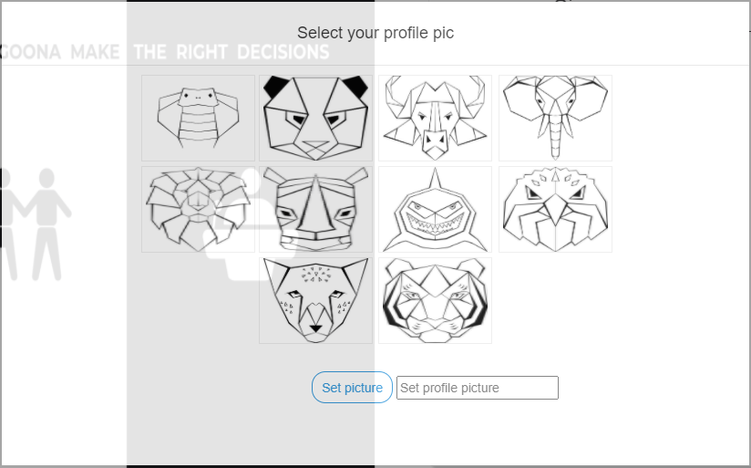
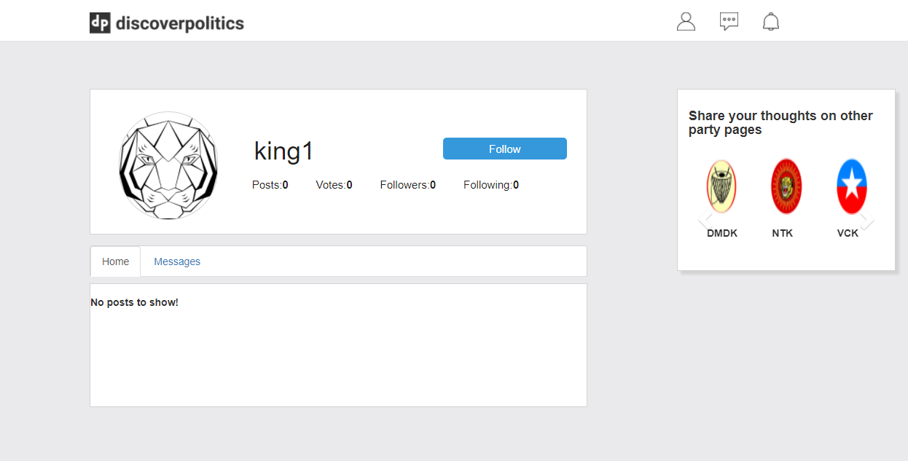

# Discover Politics
The important point to note was the entire project was built from scratch the icons, codes and logos used were developed by my team. This project was implemented by incorporating agile methodology. The proposed social media platform was compatible with all forms of device like desktop, phones, iPad and mac devices.

# Problem Statement:
In a democratic country mainstream media plays a major role in deciding the type of government should come to power. In addition, journalism plays a major role in criticizing the flaws and bringing out the best decision taken by the government in power. The mainstream journalism is one of the major pillar upon which people governments were formed. In recent days, these mainstream media was either biased or forced to shift the balance of equilibrium towards any ideology in power. The main reason for such happenings was the centralization concept prevailing in journalism. This means, the citizens acquiring knowledge about various happenings in a country majorly through the top five journalism stream.  I’m here tried to make it decentralize. This became possible because of various development happened in social media platforms.  Moreover, the main idea here was to make each citizen to act as a journalist. With the access to phone one can easily record the various event and voice out their opinion. 

# Solution Proposed:
The solution proposed was to develop a social media platform dedicated only to address the topics related to journalism. 

# Some questions related to this idea:
1.	 What is the need to develop a social networking site, if there was already one like Facebook?
The reason because the core principle of Facebook was to connect people beyond reach. In addition, it was a general platform were all one can find post related to personal, sports, music and so on. Therefore, here I tried to streamline the scope of various domains to one particular domain related to journalism.
2.	How to maintain the authenticity of information posted on to the platform?
The basic idea was to segregate people based on their ideology. For example, out of hundred people in US may be 70 support democrats and 30 support republics than a piece of news posted by democrats and if it’s not true it can be proved wrong by people supporting republics. 
3.	What about the personal security of a person?
The idea here was to assign anonymous names to the logged in users. For example, I made use of King, Queen, Jack, Thief and Police.
4.	Apart from decentralizing what are the other major benefits this social media platform gives to the society?  
This platform can act as a common ground for all ideologies to showcase their community work. For this, we can consider to develop a social media platform with only 10 pages where each page corresponds to one political party in that country. 
The project was so big and it’s difficult to cover all the concept and ideology behind it.
Programing Languages used: Php for backend, CSS, Javascript and HTMl for frontend.
Photoshop tools are used for creating icons and logos.
The following session contains screenshot of various pages present in the website and a short description of it.

# Login page:

The login page made use of email and password of the corresponding user to login to the website. Forget Password option was provided to retrieve password if any user forgets. And a signup button to redirect the website to sign in page.

# Sign Up page:
 

# Predefined profile picture to select from.
 

# Terms and condition page before creating an account.
 

Once the user created an account a verification mail will be sent to their email-id. All passwords captured here were SHA256 encrypted. 

# Personal Profile page:
 

# Accounts setting page:

# Other user profile page:
 

# Message tab

# Message notification:

# Main home page:

Where people can post their views or any other happenings in their locality which can be viewed, commented and liked by other users. User can post video of 20MB size, pictures and the comment box was build based on utf-8 encoding standards. So all languages are supported. The above image is similar to Democratic Party page in US there are similar pages for other parties.
Screenshot of Database:
In total 32 tables were deployed to store and maintain all data flowing through the website.
 

# Conclusion:
I tried to give a short workflow of major pages present in this social media platform. Data privacy issues and other account related issues were also addressed in developing this website. 

# Screenshots of various devices:

# Phone:

# IPAD:
 

# Appendix:
Requirements:
1. Need to have a local server. For example Python, WampServer etc.
2. Local database like phpmyadmin to store values.
3. Test mail server or similar tools to send verification mails.

